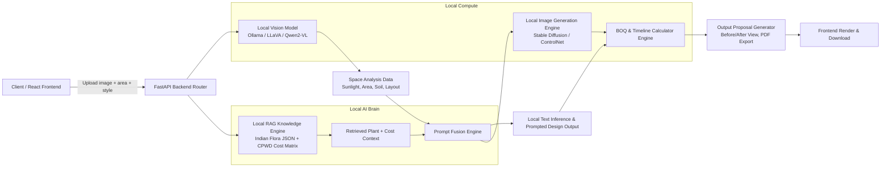

# Rahega Landscape AI Platform Architecture

## System Overview

Rahega Landscape AI is a fully self-hosted Indian landscaping platform that processes user-uploaded site imagery, retrieves locally embedded Indian flora and CPWD cost intelligence, and generates grounded landscape designs, BOQ estimates, timelines, and photorealistic renders.

## Mermaid Diagram

## Component Breakdown

### 1. Client / React Frontend

- Uploads user image, area, preferred style, and other project parameters.
- Shows the before/after slider for site image vs. generated render.
- Displays plant selection, BOQ table, timeline, and terms.
- Streams the final output proposal and download ready PDF.

### 2. FastAPI Backend Router

- Receives multipart upload requests from the frontend.
- Saves images locally and forwards paths for analysis.
- Manages backend orchestration across the Vision Model, RAG Knowledge Engine, render pipeline, and BOQ calculator.

### 3. Local Vision Model

- Uses locally installed Ollama models such as `llava` or `qwen2-vl`.
- Extracts scene context from the uploaded image: space type, sunlight level, soil cues, and layout observations.
- Falls back to local HuggingFace image captioning when Ollama is unavailable.

### 4. Local RAG Knowledge Engine

- Loads a comprehensive Indian landscaping knowledge base with 100+ plants.
- Each plant entry includes:
  - regional names and Hindi names
  - sunlight, water, soil type, climate zones
  - ideal placement, growth speed, bloom seasons, maintenance
  - commercial and landscape-specific usage notes
- Also stores CPWD-inspired market rules for materials and labor.
- Builds a local embedding store for retrieval using SentenceTransformers.
- Matches the vision-derived site summary against exact plant and cost context in the local vector store.

### 5. RAG Prompt Fusion Engine

- Combines the vision analysis with retrieved plant and cost documents.
- Injects retrieved knowledge directly into the LLM prompt.
- Ensures design suggestions, BOQ, and renders remain grounded in Indian flora and market reality.
- Uses exact context matching rather than generic generation.

### 6. BOQ & Timeline Calculator Engine

- Reads CPWD and market rate rules from the knowledge base.
- Calculates itemized costs for:
  - soil mix
  - organic fertilizers
  - turf/grass selection (Zoysia, Bermuda, Selection 88)
  - drip irrigation
  - landscape lighting and pebbles
  - labor costs per sq. ft.
- Computes execution velocity and total days based on area and worker productivity.
- Generates a risk-aware timeline, contract terms, and mobilization charges.

### 7. Local Image Generation Engine

- Uses Stable Diffusion for photorealistic landscape renders.
- Optionally integrates ControlNet-style conditioning for structure-aware designs.
- Converts prompt-fused design instructions into a high-resolution before/after preview.

### 8. Output Proposal Generator

- Aggregates:
  - site analysis
  - selected plants and reasoning
  - detailed BOQ and cost summary
  - execution timeline
  - design render images
  - terms and conditions
- Provides a frontend-ready before/after slider.
- Can export the same information into a printable proposal or PDF.

## Data Processing Pipeline

1. **Image upload**
   - Frontend sends image, area, and style preferences to the backend.

2. **Local detection**
   - FastAPI saves the image and calls the local vision model.
   - The vision model identifies space type, sunlight, and soil cues.

3. **RAG retrieval**
   - The backend builds a precise query from the vision output and selected style.
   - The local vector store retrieves matching plant specifications and cost rules.

4. **Prompt fusion**
   - Retrieved knowledge is fused into the LLM prompt.
   - The LLM is asked to produce a landscape recommendation grounded in the retrieved data.

5. **Plant & BOQ selection**
   - The engine filters and ranks the best plant matches.
   - It calculates itemized BOQ, cost totals, and labor days.

6. **Render generation**
   - Stable Diffusion generates a photo-realistic landscape concept.
   - The render uses the same grounded design narrative and plant palette.

7. **Proposal assembly**
   - The backend aggregates textual and visual outputs into a structured response.
   - The frontend renders the before/after slider and detailed tables.
   - The system can also produce a printable proposal or PDF export.

## RAG Knowledge Engine Intelligence

The AI Brain is intentionally designed to be:

- **Rich:** 100+ Indian plant profiles with Hindi & regional context.
- **Smart:** exact context matching using vector retrieval and prompt fusion.
- **Comprehensive:** includes native and commercial landscaping plants, turf options, irrigation, lighting, and labor rules.
- **Grounded:** every plant choice and BOQ item is backed by the local knowledge base.
- **Offline:** no external APIs required for knowledge retrieval or inference.

## Deployment Notes

- The entire architecture runs locally or on your own server.
- The RAG engine uses local embeddings and cached vector stores.
- The vision and render models are local open-source models.
- This platform is designed for offline Indian landscaping workflows with zero dependency on paid APIs.
